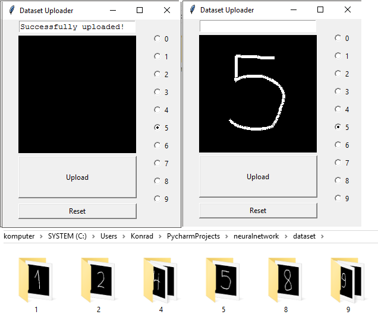

# datasetuploader

Python based handwritten digits uploader  
You can easily expand your handwritten dataset for neural network.

Step 1: Select which digit you want to upload  
Step 2: Draw it in the black box  
Step 3: Click "Upload" button  
The application will create a properly named folder (/dataset/0-9/ for each digit)  
and save what you draw into .png file (for example: /dataset/0/0_0.png, /dataset/0/0_1.png etc.)
